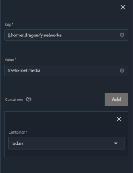

> [!Note]
>
> This is an updated README for [casse-boubou/dragonify](https://github.com/casse-boubou/dragonify), a fork of the original [tjhorner/dragonify](https://github.com/tjhorner/dragonify)

Dragonify is a utility for TrueNAS SCALE that enhances inter-app communication by automatically managing Docker networks. It allows containers to communicate with each other via DNS, restoring and extending the networking functionality available in previous TrueNAS versions. This updated version provides granular control over network creation and container connections, improving both flexibility and security.

It's a stop-gap until inter-app networking is properly implemented.

> [!Warning]
>
> Dragonify introduces functionality that is unsupported by iXsystems. If you are having problems with your TrueNAS installation or its apps, please try stopping Dragonify and restarting all apps to see if the problem persists.

### How It Works

Dragonify listens to Docker events to automatically manage networks and container connections:

- It create, manage, and delete Docker bridge networks. Networks created by Dragonify are labeled for automatic removal when they are no longer in use.
- When a container is connected to a network, Dragonify assigns it a DNS alias in the format `{service}.{project}.svc.cluster.local`, allowing other containers on the same network to resolve its address by name.
- You can use environment variables and container labels to customize how Dragonify behaves, from creating multiple isolated networks to controlling which containers get connected.
- Only works on apps managed by TrueNAS Scale/CE UI, by checking for if the project/stack name in `com.docker.compose.project` property starts with `ix-`.

### Configuration

You can control Dragonify's behavior using a combination of environment variables and Docker labels on your application containers.

#### Environment Variables

These variables are set on the `dragonify` container itself.

Here's the environment variables section as a table:

| Variable | Description | Values | Example |
|----------|-------------|--------|---------|
| `LOG_LEVEL` | Sets the verbosity of the application's logs. | `info` (default), `debug` | `LOG_LEVEL: debug` |
| `CONNECT_ALL` | Controls whether all TrueNAS-managed `ix-` apps should be automatically connected to the default `apps-internal` network. | `true` (default), `false` | `CONNECT_ALL: "false"` |
| `CUSTOMS_NETWORKS` | A comma-separated list of Docker networks that Dragonify should create on startup. This is useful for pre-defining networks you plan to use across multiple applications. | e.g. `media-net,home-automation-net` | `CUSTOMS_NETWORKS: apps-internal-custom,app-external` |

#### Container Label

To connect an application container to one or more specific networks, you use a Docker label.

- `tj.horner.dragonify.networks`
    - **Description**: A comma-separated list of networks to which the container should be connected. If a specified network does not exist, Dragonify will create it automatically.
    - **Applies to**: Any application container you want Dragonify to manage.
    - **Example**:

```yaml
  labels:
    - "tj.horner.dragonify.networks=media-net,downloads"
```

