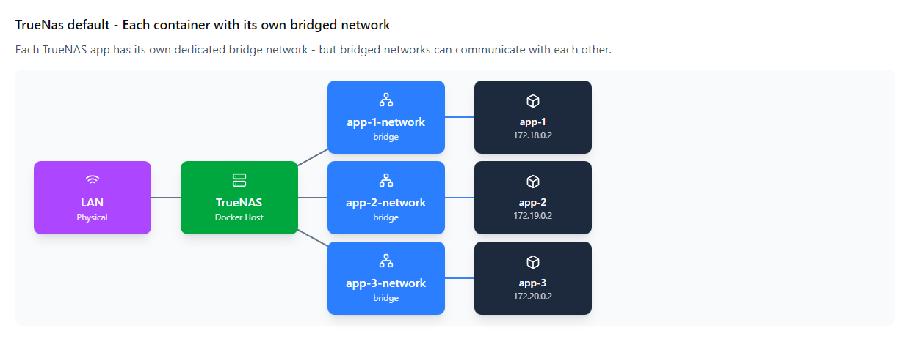
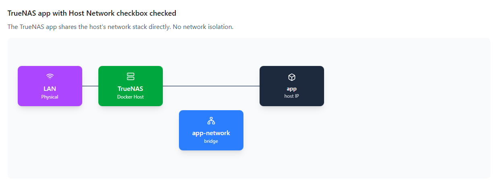
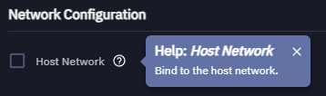
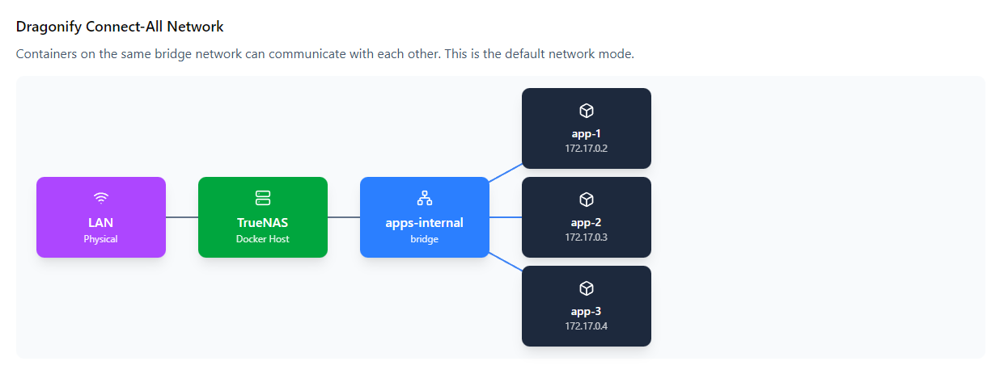
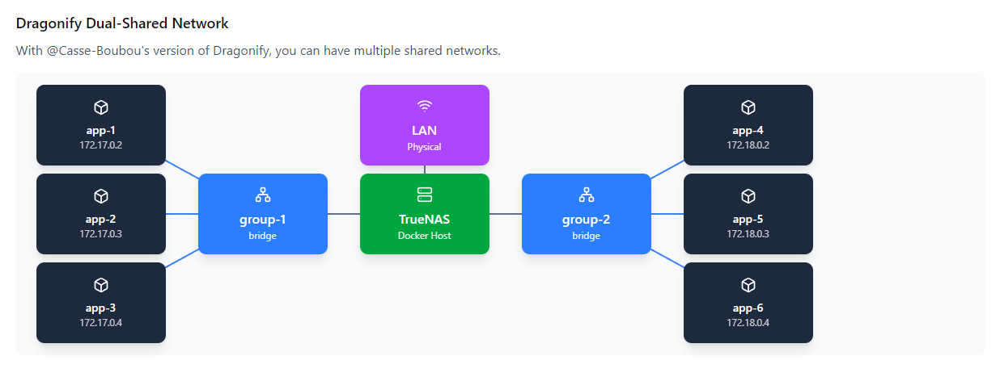
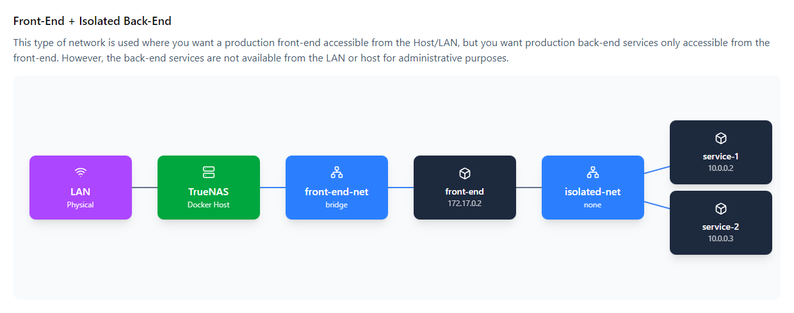
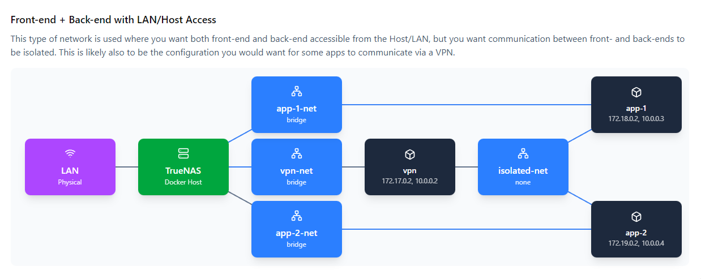
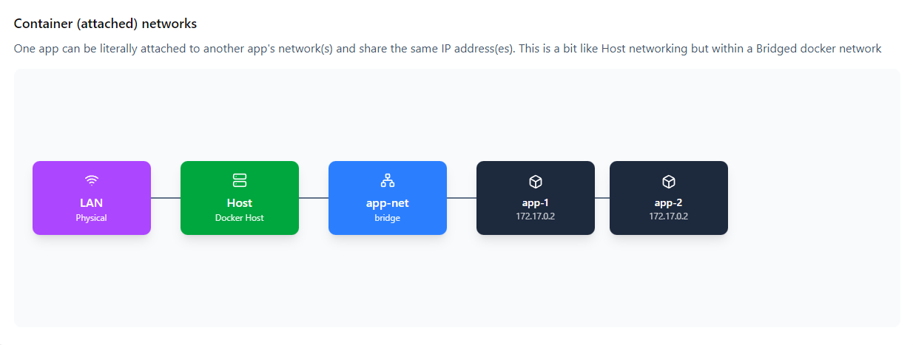
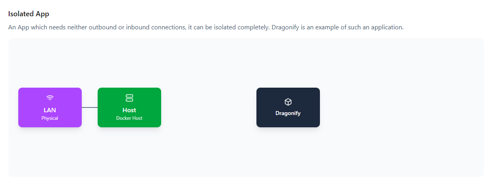

<script type="module"> import mermaid from 'https://cdn.jsdelivr.net/npm/mermaid@11/dist/mermaid.esm.min.mjs'; mermaid.initialize({securityLevel: 'loose',});</script>
# Dragonify

***Dragonify*** is a small docker-container based utility app for TrueNAS Scale 24.10 (Electric Eel) onwards
which can reconfigure the default Docker networks provided by TrueNAS Scale for apps to allow them to communicate
with each other.

This is a fork of work by
[@TJHorner](https://github.com/tjhorner/dragonify),
[@Casse-Boubou](https://github.com/casse-boubou/dragonify) &
[@EngTurtle](https://github.com/EngTurtle/dragonify)
and full credit needs to be given to them
for the original code and underlying ideas.

## Short Explanation

In Dragonfish and earlier (which used Kubernetes)
all apps were on the default shared virtual bridged network,
but from Electric Eel onwards
TrueNAS creates a separate virtualised Docker bridged network for each TrueNAS app
(presumably for security reasons to isolate apps from one another),
and this makes it much more difficult or impossible for different apps to communicate with one another.

Dragonify provides a solution to this problem by allowing you
to disconnect apps from the app-specific bridged network,
and connect them onto one or more shared networks.

### Caution

1. This approach of changing networks uses official documented Docker API calls,
but is unsupported by TrueNAS.
This app is independently produced open-source software,
and is also unsupported by TrueNAS.

2. This app changes the network configuration of a container
**after** it has initialised.
Some apps are not capable of recognising such network changes
or are not capable of reconfiguring themselves to use the new network.

   Some experimentation and trial and error
   may be needed to choose a network approach
   which makes shared networking work
   for your specific combination of apps.

3. Dragonify uses the Docker socket / Docker API to change networks,
and this comes with some security risks.
We have done what we can to mitigate any security risks
(see [Security Hardening](#Security-Hardening) below)
however you should ensure that you
are comfortable with accepting any remaining security risks.

   **Note:** To put this security risk in context,
   it is also true of other Docker management platforms
   that use the Docker API through the Docker API socket
   such as Portainer or Dockge -
   we are simply being up-front about it.

## Status

***THIS IS A WORK-IN-PROGRESS VERSION OF THE README DESCRIBING A TO-BE VERSION OF DRAGONIFY -
WITH THE PURPOSE OF GIVING A VISION AND INVITING INPUT ABOUT THE VISION AND TECHNICAL DETAILS OF IMPLEMENTING IT.
YOUR INPUT IS REQUESTED PARTICULARLY:***

* ***WHAT ARCHITECTURES SHOULD BE ADOPTED?***
* ***HOW SHOULD THE USER CONFIGURE THEM?***
* ***HOW DO WE GET CONTAINERS TO RECOGNISE NETWORK ATTACHMENTS/DETACHMENTS?***
* ***HOW CAN WE MINIMISE IMPACTS OF NETWORK ATTACH/DETACH?***
* ***HOW DO WE SET HOST NAMES AND MAKE SURE DNS WORKS?***

***PLEASE PROVIDE YOUR FEEDBACK TO
[SOPHIST@SODALIS.CO.UK](mailto:sophist@sodalis.co.uk?subject=Dragonify%20feedback).***

## Technical Warnings

1. This Dragonify utility is a stop-gap until inter-app networking is fully implemented in TrueNAS Scale.
***See https://forums.truenas.com/t/inter-app-communication-in-24-10-electric-eel/22054 for a discussion about this.***

   ***WARNING:*** Dragonify introduces functionality that is unsupported by iXsystems. If you are having problems with your TrueNAS installation or its apps, please try stopping Dragonify and restarting all apps to see if the problem persists.

2. Dragonify achieves the target network reconfiguration by using the [Docker REST Api](https://docs.docker.com/reference/api/engine/version/v1.47),
to run the equivalent of `docker network connect` commands against already running containers.

   It does ***not*** update the TrueNAS application definitions to make the changes before the container starts.

   Because these commands change the container's network configuration at run-time ***after*** it has initialised:

   1. the container needs to recognise that it's configuration has changed; and:

   2. the container needs to reconfigure it's IP routing tables; and

   3. the app also may need an ability to recognise and handle post-initialisation network changes.

   TrueNAS apps are generally simple packaging of containers created and maintained by others,
   so if you have a container which cannot handle this then you need to take this up with the
   container authors and **not** with TrueNAS.

   If you have such an app (which cannot handle network changes)
   it may be possible to:

   * leave it on the existing TrueNAS default application-specific Docker network; and
   * connect the other apps either to the same network or to the container itself.

## Change Log

| Author | Version |Image | Description
|-|-|-|-
| [TJ Horner](https://github.com/tjhorner) | v1.0 | [ghcr.io/tjhorner/dragonify:main](https://github.com/tjhorner/dragonify) | Connect all non-Host containers to a single shared bridged Docker network (`CONNECT_ALL`)
| [Casse Boubou](https://github.com/casse-boubou) | v1.1 | [ghcr.io/casse-boubou/dragonify:main](https://github.com/casse-boubou/dragonify) | Allow individual containers to define their own Docker bridged network - allows multiple shared bridged Docker networks (`CONNECT_ALL=false`)
| [EngTurtle](https://github.com/EngTurtle) | v1.2 | [ghcr.io/EngTurtle/dragonify:main](https://github.com/EngTurtle/dragonify) | Handle parallel requests to create a new network (for e.g. multiple containers starting simultaneously in e.g. NextCloud), security hardening, switch to `esbuild`
| [Sophist-UK](https://github.com/Sophist-UK) | v2.0alpha | [ghcr.io/Sophist-UK/dragonify:main](https://github.com/Sophist-UK/dragonify) | Refactored with cleaner code & additional functionality (see bullet list below)

**Note:** This table will be updated as v0.4 progresses and when image locations above are changed if/when PRs are merged.

Additional credit to [@shanelord01](https://github.com/shanelord01)'s [pangolin-autonet-watcher](https://github.com/shanelord01/pangolin-autonet-watcher)
for inspiration on improved DNS handling.

The changes made in Sophist-UK's version are (or will be once implemented):

* Completely refactored clean TS code with strict typing
* Additional Docker network approaches (none, Container)
* Dragonify clean-up on termination - essentially connecting apps back to their default networks.
* Network pruning and re-creation
* Improved logging
* Filtered container start/stop event handling
* Clean termination by handling the Dragonify container terminate signal
* Caching of networks and connected containers to avoid unnecessary Docker calls
* Github actions for linting and TypeScript code quality analysis etc.

## Docker Network approaches

This section is designed to give you a pictorial representation of the different ways you can use Dragonify
and details of how to set up Dragonify in each of the situations.

Whilst this is ***not*** a substitute for a detailed understanding of [Docker Networking](https://docs.docker.com/engine/network/),
it is hoped that this will be sufficient for you to decide which approach to use and how to set things up.

### TrueNAS Docker Default Networks



This diagram shows how TrueNAS defines Docker Networks for each of its apps.

TrueNAS creates a separate bridged network for each app,
and that bridged network has only that specific app's container(s) attached to it.
If you specify ports to be opened,
then these are opened on the Host IP address and port-forwarded to the bridged IP address.

It is possible for one container to request services from another container *on a different bridged network*,
however for that to work a port needs to be opened on the host for each of the services,
and this is considered a security risk (particularly in Enterprise and/or production environments)
because it means that a hacker can gain direct access to a back-end service through this open port.

For that reason, a lot of people want to continue to use some form of shared Docker network,
so that requests from one container to another can be made purely within a single Docker network
and without opening ports on the host that might be a security risk.

Hence, Dragonify was born as a means of bypassing the Docker Network restrictions
in the initial TrueNAS Docker Scale implementation.

**To-Do:** Update to confirm what happens if you have multiple containers with the same image?

### TrueNAS Docker Host Network

Before looking at what Dragonify can do, it is worth just documenting the only
alternative networking approach in TrueNAS Scale Electric Eel's Docker implementation,
"Host Networks".



When you create an App using the TrueNAS Scale UI, you generally have a checkbox that can be selected to use Host Network:



If you check this box, then the container does not use a bridged network, but instead is considered like a native app,
accessed directly using the host IP address(es). If you open ports for this app, these ports go directly to the container.

Dragonify ignores apps that use Host Networks and does not attempt to connect the container(s) to a Docker Network.

**Note:** If you specify a Dragonify Docker Label on a Host Network,
a log warning will be issued to notify you of this invalid combination,
but no network changes will be made regardless.

**Note:** If you select `Host Networks`,
despite not connecting the container(s) to it,
TrueNAS continues to create the aligned Docker Bridged Network.

### Dragonify 1.0 (TJHorner)

This diagram shows how both earlier versions of TrueNAS that used Kubernetes
mapped apps to a single virtualised container network (except for Host Network apps of course),
and how the Dragonify v1.0 maps networks in Electric Eel and later versions of TrueNAS that use Docker.



As you can see this original implementation was a one-option approach,
designed solely to mimic how networks were defined in TrueNAS SCALE Dragonfish and earlier versions,
by connecting all containers to a single common Docker bridged network (`apps-internal`).

This is how the original TJHorner version of Dragonify worked,
and how later Casse-Boubou, EngTurtle and Sophist-UK versions still work
if you set `CONNECT_ALL = "true"`
(which is the default i.e. if you **don't** set `CONNECT_ALL = "false"`)...

### Dragonify 1.1 (Casse-Boubou)

To provide greater flexibility @Casse-Boubou extended the functionality so that
if you specify an environment variable `CONNECT_ALL = "false"`, then:
* for each container, you can define using a Docker Label (`tj.horner.dragonify.networks`)
the alternative network(s) you want Dragonify to connect the container to
* if you don't define such a label then Dragonify does nothing with the container,
leaving it on the default application-specific bridged network.

Now, instead of a single `apps-internal` bridged network,
you can now have several shared bridged networks for different groups of applications.



You would achieve the above by defining setting Dragonify environment variable `CONNECT_ALL = "false"`
and setting a labels on the apps as follows:

* app-1/2/3 - `tj.horner.dragonify.networks = "group-1"`
* app-4/5/6 - `tj.horner.dragonify.networks = "group-2"`

### Dragonify 1.2 (EngTurtle)

@EngTurtle delivered some small, but essential improvements:

* Fix for multiple parallel attempts to create a new network causing Dragonify to crash
* Security hardening (no network, Docker socket read-only)
* Switch from pnpm to npm to avoid need for network
* Switch from `tsc` to `esbuild`

### Dragonify 2.0 (Sophist-UK)

Dragonify 2.0 is a significant further enhancement,
building upon the code and ideas from previous versions,
as follows:

* Additional Docker network types in addition to bridged (none, container)
* Network gateway priorities
* Improved DNS settings

+ Code refactor to be fully strict-typed TypeScript
* Caching network information to avoid repeated Docker API calls for the same information
* Improved documentation

To give some idea of the additional network configuration this enables:

#### Front-end + Isolated Back-ends



This network design is a classical front-end/back-end network design,
isolating the back-end network from the network providing user access and
physically preventing users from having

You would achieve the above by defining setting Dragonify environment variable `CONNECT_ALL = "false"`
and setting a labels on the apps as follows:

* front-end - `tj.horner.dragonify.networks = "front-end-net,none:isolated-net"`
* service-1/2 - `tj.horner.dragonify.networks = "none:isolated-net"`

This model can also be used to e.g. route apps internet access through a VPN.

This is fine for situations which don't need admin access to the back-end apps,
but in many cases, especially for VPN situations,
you also want inbound admin access from the host / host network,
and for this you need a hybrid solution...

### Dragonify Front-end + Accessible Back-end

The trouble with a fully isolated back-end network is that you cannot access
e.g. an admin panel from the host in order to e.g. diagnose issues,
and instead are limited only to opening a Docker shell from within the TrueNAS host UI
(assuming that the container has been based on an O/S image that includes a shell).
If the app includes admin panels for the back-end,
then there is no way to access them and they are unusable.

An alternative is to have an isolated back-end network to connect to a VPN app
and / or that is only accessible from the front-end app,
and provide a separate, secondary bridged network for inbound access.
The key here is to ensure that outbound communications go through the isolated network
and not the bridged network(s).



You would achieve the above by defining setting Dragonify environment variable `CONNECT_ALL = "false"`
and setting a labels on the apps as follows:

* vpn - `tj.horner.dragonify.networks = "vpn-net,none:isolated-net"`
* service-1 - `tj.horner.dragonify.networks = "none:isolated-net,app-1-net"`
* service-2 - `tj.horner.dragonify.networks = "none:isolated-net,bridged:app-2-net"`

### Dragonify Container Attachment



You would achieve the above by defining setting Dragonify environment variable `CONNECT_ALL = "false"`
and setting a labels on the apps as follows:

* app2 - `tj.horner.dragonify.networks = "container:app1"`

Note: The actual container may be named `app-1` if a custom TrueNAS app defined through the UI,
but it may be called `ix-app1-app1-1` if a normal TrueNAS app or a custom app defined through a YAML compose file.

This has not yet been implemented and
some difficulties with this approach can be foreseen.
For example,
if app2 wants to be attached to container:app1, then what happens if:

1. app1 is not started?
2. at some future point app1 starts?
3. at some future point app1 stops?

Potential ways of handling these are as follows:

1. Leave app2 disconnected from app2 and wait for app1 to start?
2. We can connect app2 if we know we need to do so. So do we:
   1. Keep track of started apps that use container attachment?
   2. Have a label on app1 (e.g. contained:app2) to mirror the definition?
   3. Scan through all running apps to see if one has container:app1?
3. What does Docker do? What do we need to do if anything?

**Note:** It would also be possible to issue TrueNAS API calls to start the app1 app,
however:

* This would likely require Dragonify to have a network connection introducing security risks
* Should Dragonify do this without the user's approval?

so this idea has been rejected.

### Dragonify Completely Isolated Container



This is how Dragonify should now configured to run (in a YAML file),
but just in case, it disconnects itself if needed.

However, you can achieve this for other apps by setting a label as follows:

* `tj.horner.dragonify.networks = ""`

## Docker visibility

Sophist recommends that people look to implement the TrueNAS app ***Arcane***
because it provides a nice UI which enables you to get a list of Containers and Networks,
and drill down to the details of each.

Whilst you can certainly get this information by running Docker commands from a sudo shell,
having a UI to navigate is significantly easier.

This can be very helpful to get more insight into TrueNAS' Docker infrastructure
than you can get from the TrueNAS apps UI,
and perhaps essential if you want to debug or contribute to Dragonify infrastructure.

## Installation

The following instructions assume that you are installing v2.0.
If you decide to install an earlier version,
then you will need to use the instructions from the earlier author's repos.

As yet, Dragonify has not made it to the TrueNAS Apps Store,
so you will need to install it as a Custom App in TrueNAS Scale,
and there are a couple of ways to do this after going to
the Apps page in the TrueNAS UI and clicking `Discover Apps`:

### Custom Compose.yaml...

1. Click **⋮** in the top-right corner, then "Install via YAML".

2. Set the app-name to `dragonify`, and paste the following YAML into the text box.

```yaml
services:
  dragonify:
    image: ###choose image according to the version table above###
    restart: always
    environment:
      LOG_LEVEL: info # change to debug for more verbose logging
      CONNECT_ALL
    volumes:
      - /var/run/docker.sock:/var/run/docker.sock
```

Once started, all of your apps will now be connected on the same Docker network with DNS aliases for each service.

## Security Hardening

The Docker API does not have any security controls
other than limiting access to the API,
so you need to be confident that any app
which you give mapped access to the docker API socket
is safe to install.

The reason that this needs to be considered is because
through the Docker API a hacker could potentially
gain root access to your system
(for example, by downloading code from the internet and
then telling Docker to run it with root privileges).

To reduce or prevent these risks we have taken the following approach:

   * Making the socket read-only (to prevent it being deleted)
   * Making the code open-source (so that the Dragonify code can be independently reviewed)
   * Running Dragonify in a container that does NOT have any network access or host-mapped directories
   (thus preventing hacker's malicious code being inserted or downloaded from the internet)

Whilst we have done everything that we believe is possible to limit the risks
(and will respond positively to any Github issues or PRs which
identify or close further risks not previously identified)
you need to make your own decision about whether the remaining risk is acceptable.

**Note:** As previously noted, other Docker management tools such as Dockge and Portainer
use the same technology and have the same risks
(or perhaps greater risks since they **are** network connected).
We are simply being up-front and explicit about those risks
in order that users can make informed security decisions about using Dragonify.

### Custom App screens...


## Technical Details

Dragonify uses the Docker API to make calls which have equivalent Docker CLI commands e.g.

| Action | Example Command
|-|-
| Creating a network |
| Attaching a container to a network | `docker network connect apps-internal --alias postgres.ix-postgres.svc.cluster.local ix-postgres-postgres-1`
| Detaching a container from a network |
| Deleting a network |

Dragonify creates network and attaches containers to them:
* when Dragonify starts - for existing running TrueNAS apps
* after Dragonify is running - when new TrueNAS apps start

Dragonify detaches containers from networks and deletes empty networks:
* when Dragonify is running - when TrueNAS apps stop
* when Dragonify closes - for existing running TrueNAS apps

## Technical References

### Docker Background Info
* [Docker Networking](https://docs.docker.com/engine/network)
* [Docker API](https://docs.docker.com/reference/api/engine/version/v1.47)

### For Dragonify Development
* [Dockerode](https://github.com/apocas/dockerode)
* [Dockerode TS type definitions](https://github.com/DefinitelyTyped/DefinitelyTyped/blob/master/types/dockerode/index.d.ts)

## License

MIT / ISC